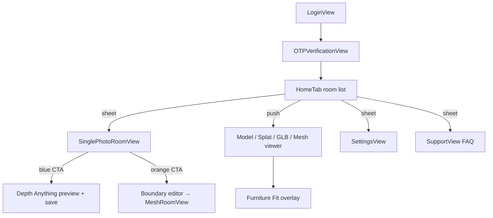

# Furnit iOS — UI / look-and-feel audit (read-only)

> **Historical snapshot.** This 2026-07-10 audit predates `Furnit/Theme/Theme.swift`,
> the Paafekt design tokens/assets, and the current branded login/viewer chrome. Do not
> treat statements such as “no centralized design system” or “generic cube login” as
> current. See [`PAAFEKT_DESIGN_SYSTEM.md`](PAAFEKT_DESIGN_SYSTEM.md) and the live code.

**Date:** 2026-07-10  
**Scope:** Swift iOS app (`Furnit/`) — code & asset review only; **no app code modified** for this audit.  
**Screenshots:** Runtime screenshots were **not captured** in this session (no Simulator run). Wireframe descriptions and asset references below are from source. Capture on a physical device for designer handoff.

---

## Summary (designer-facing)

Furnit is **SwiftUI-first** with UIKit bridges for AR, Metal splats, SceneKit/RealityKit, and Furniture Fit camera overlays. There is **no centralized design system** — colors, radii, and button treatments are defined **inline per screen**, often using semantic system colors plus one-off `.blue` / `.green` / `.orange` / `.purple` accents. The app **forces dark mode globally** (`.preferredColorScheme(.dark)`), while many views still use light-style grouped backgrounds and multicolor accents, which creates a **mixed “dark shell + rainbow utility UI”** feel.

The **most unpolished areas** today are: (1) the **home room list** (dense metadata, emoji hint, file-type color soup), (2) **room creation** (two large competing CTA cards with different border/fill languages), (3) **3D viewer chrome** (many floating toolbar pills, hint overlays, and brain/segment controls duplicated across `ModelViewerView`, `SplatRoomView`, `GLBRoomView`, `MeshRoomView`), and (4) **settings** (standard `Form` with per-row icon color, no tie-in to brand). Login is the most “designed” screen (gradient hero + glass card); the rest of the app rarely matches that level of cohesion.

**Brand asset:** App icon is a dark brushed-metal hexagonal mark with gold edge highlights on black (`Furnit/Assets.xcassets/AppIcon.appiconset/`). In-app login still uses generic `cube.fill` SF Symbol, not the wordmark/icon.

---

## 1. Framework & structure

### Primary stack
| Layer | Usage |
|-------|--------|
| **SwiftUI** | Shell navigation, lists, settings, login, photo room flow, most overlays |
| **UIKit bridges** | `UIViewRepresentable` / `UIViewControllerRepresentable` for AR capture, Gaussian splat (`MTKView`), SceneKit preview planes, Furniture Fit (`FurnitureFitContainerView`) |
| **RealityKit / SceneKit / ARKit / Metal** | 3D viewers and capture — not layout UI, but dominate screen real estate |

### Entry & navigation shell
- `FurnitApp.swift` → `RootView` → authenticated: `HomeViewWithBottomBar` → **`HomeTab` only** (comment: *“Bottom bar removed”*; no `TabView`).
- Unauthenticated: `LoginView` → `OTPVerificationView`.

### Key files (UI, not ML)
| Area | Files |
|------|--------|
| Home / list | `Views/ContentView.swift` (`HomeTab`, `HomeViewModelRow`, `SupportView`) |
| Auth | `Authentication/LoginView.swift`, `OTPVerificationView.swift` |
| Photo → 3D | `Views/Components/SinglePhotoRoomViewer.swift` |
| USDZ viewer | `Views/ModelViewerView.swift`, `Views/Components/RealityKitView.swift` |
| Splat / GLB / mesh | `Views/SplatRoomView.swift`, `GLBRoomView.swift`, `MeshRoomView.swift` |
| Furniture Fit | `Views/FurnitureFit/FurnitureFitView.swift` (UIKit container) |
| Settings | `Views/SettingsView.swift` |
| Shared overlays | `Views/Components/FileInfoSnackbar.swift` and feature-local progress overlays |
| Localization | `Utilities/Localization.swift`, `*.lproj/Localizable.strings` |

### Design system?
**No.** There is no `Theme.swift`, spacing tokens, or shared button style enum. Patterns are copied informally:
- `AccentColor` in asset catalog (single accent)
- Repeated `.cornerRadius(12|16|20)`, `.padding()`, SF Symbol + `.headline` / `.caption`
- `HomeViewModelRow` and `FileInfoSnackbar` are rare reusable visual components

## 2. Color

### Asset catalog
| Name | Hex (sRGB) | Notes |
|------|------------|--------|
| **AccentColor** | `#007AFF` (R0 G122 B255) | Only named brand color in catalog; underused vs inline `.blue` |

No other color sets in `Assets.xcassets` (no semantic `Background`, `Surface`, `TextPrimary`, etc.).

### Global appearance
```swift
// FurnitApp.swift
.preferredColorScheme(.dark)  // app-wide dark mode lock
```

Light/dark **user toggle is not supported** — always dark. Many views still use:
- `Color(.systemGroupedBackground)`, `Color(.systemBackground)`, `.primary` / `.secondary` (adapt, but locked to dark palette)
- Hardcoded **semantic-by-hue** accents: `.blue`, `.green`, `.orange`, `.purple`, `.cyan`, `.pink`, `.red`

### Palette as used in UI (de facto)
| Role | Typical values |
|------|----------------|
| **Primary CTA (AI path)** | `.blue`, `Color.blue.opacity(0.1)` fill + 2pt blue stroke |
| **Secondary CTA (manual path)** | `.orange`, orange fill/stroke |
| **Success / create** | `.green` (empty-state button, dimension lines) |
| **File type icons** | USDZ `.green`, PLY `.purple`, mesh `.orange`, GLB `.blue` (`HomeViewModelRow`) |
| **Login hero** | `LinearGradient` blue 0.8 → purple 0.6 |
| **Login form glass** | white 15% fill, white 30% stroke |
| **3D viewer chrome** | black 55–72% opacity capsules, white text |
| **Warning / limit banner** | `Color.orange.opacity(0.1)` |
| **Destructive** | `.red` (delete account, failed states) |

**Assessment:** Functional color coding, not a unified brand palette. Accent catalog color matches system blue but login/settings/CTAs don’t consistently use `AccentColor`.

---

## 3. Typography

### Font family
- **100% San Francisco (system)** — no `Font.custom` / custom typefaces in `Furnit/`.

### Common text styles (observed)
| Style | Typical use |
|-------|-------------|
| `.largeTitle` + `.bold` | Login app name |
| `.title2` + `.bold` | Section headers, photo picker title |
| `.title3` | Toolbar icons |
| `.headline` | Row titles, button labels, overlay titles |
| `.subheadline` | Taglines, secondary buttons, overlay body |
| `.caption` / `.caption2` | Metadata, hints, badges, FAQ |
| `.footnote` | Settings section footers |
| `.system(size: 11, weight: .semibold)` | Room measurement pill in viewer nav bar |
| `.caption.monospaced()` | Room W×H×D in list rows |

### Dynamic Type
- **Partial.** Standard SwiftUI text scales with Dynamic Type by default, but many controls use **fixed** `.system(size:)` (icons 50–60pt, pills 11pt) and **no** `@ScaledMetric` usage found.
- **Risk:** Toolbar pills, D-pad overlays, and Furniture Fit UI may not reflow well at largest accessibility sizes.

---

## 4. Components

### Buttons
| Pattern | Example |
|---------|---------|
| **Filled rect** | Login OTP: `RoundedRectangle(cornerRadius: 12)` blue/gray |
| **Tinted card CTA** | Photo room: full-width row, 10% opacity fill, 2pt stroke, 12–16pt radius |
| **Plain toolbar** | SF Symbol `.title3` in nav bar |
| **Swipe actions** | Standard iOS list blue/red |
| **Capsule pills** | 3D viewers: black semi-transparent background, white label |

No shared `PrimaryButtonStyle` / `SecondaryButtonStyle`.

### Cards & lists
- **Home:** `List` + `PlainListStyle`, custom `HomeViewModelRow` (icon tile 40×40, 8pt radius, 10% tint background).
- **Settings:** Standard `Form` + `Section` headers/footers.
- **FAQ (`SupportView`):** Grouped disclosure-style FAQ sections.
- **Snackbar:** `FileInfoSnackbar` — 12pt radius, light shadow (black 15%, radius 8, y: 4).

### Sheets & modals
- Room creator, Settings, Help: `.sheet` + `NavigationStack`
- Boundary editor: `.fullScreenCover`
- Alerts: room limit, delete, rename

### Recurring visual tokens (informal)
| Token | Values seen |
|-------|-------------|
| Corner radius | **8** (icon tiles), **10** (inputs), **12** (cards/buttons), **16** (large cards), **20** (modals/glass), **25** (pills) |
| Shadows | Login icon shadow; snackbar shadow; otherwise minimal |
| Borders | 1–2pt stroke on tinted CTAs; FAQ none |
| Fills | System grouped background; opacity tints 0.1–0.15 |

### Reusable components (short list)
- `HomeViewModelRow`, `FileInfoSnackbar`, `ContentUnavailableView` (empty states), and `BoundaryLinesCanvas` / draggable handles (manual room)

---

## 5. Screens & flows

### Screen map



### Key screens (layout + screenshot status)

#### A. Login (`LoginView`)
- **Purpose:** Phone OTP auth.
- **Layout:** Full-screen blue→purple gradient; centered white `cube.fill` + app name; frosted card with name/phone fields; country picker; Send OTP.
- **Screenshot:** Not captured — see wireframe below.

```
┌─────────────────────────┐
│  gradient blue → purple   │
│         [cube]            │
│        Furnit             │
│   tagline (white)         │
│ ┌─────────────────────┐   │
│ │ glass card          │   │
│ │ name, phone, OTP CTA│   │
│ └─────────────────────┘   │
└─────────────────────────┘
```

#### B. Home — room list (`HomeTab`)
- **Purpose:** Saved rooms + bundled samples; create room; settings/help.
- **Layout:** Large nav title “Rooms”; leading **photo+** create, trailing **?** and **gear**; optional orange limit banner + total storage; emoji swipe hint; plain list rows with type-colored icons and dense caption metadata.
- **Screenshot:** Not captured.

#### C. Photo room creator (`SinglePhotoRoomView` sheet)
- **Purpose:** Pick/capture photo; choose AI vs manual path.
- **Layout:** Initial: camera + gallery cards (blue bordered); after image: preview + two stacked method cards (blue AI, orange manual).
- **Screenshot:** Not captured.

#### D. Depth Anything result (`DepthAnythingPreviewRoomView` → save → `ModelViewerView`)
- **Purpose:** Instant flat-photo preview (no ML); full GeoCalib + Depth Anything + RTMDet metric generation on first save; saved rooms open in RealityKit USDZ viewer.
- **Layout:** Full-bleed 3D; top nav with back, measurement pill, brain/segment/snapshot controls; bottom hints; Furniture Fit sheet.
- **Screenshot:** Not captured.

#### E. 3D splat viewer (`SplatRoomView`)
- **Purpose:** Saved PLY Gaussian splat rooms (MetalSplatter + SplatIO; SparkJS removed).
- **Layout:** Gray background + Metal splat; similar toolbar cluster as USDZ viewer; D-pad / joystick overlays; furniture chips.
- **Screenshot:** Not captured.

#### F. Settings (`SettingsView`)
- **Purpose:** Manual room dimensions sliders, viewer toggles, legal links, logout/delete.
- **Layout:** Standard grouped `Form`; each row has colored SF Symbol (blue/green/orange/cyan/pink/purple).
- **Screenshot:** Not captured.

### Other flows (shorter)
| Flow | Entry | UI notes |
|------|-------|----------|
| **Manual mesh room** | Orange manual setup | Full-screen boundary drag UI (green floor, magenta VP, orange ceiling) → progress overlay → `MeshRoomView` |
| **Furniture Fit** | Brain / segment in viewers | UIKit camera + Metal overlay; not SwiftUI-styled |
| **AR photo capture** | Camera in room creator | `ARRoomPhotoCaptureRepresentable` |
## 6. Navigation & motion

### Navigation structure
- **Single stack:** `NavigationStack` on home; push to viewers; sheets for create/settings/help.
- **No tab bar**; home navigation uses a single stack.
- **Modals:** `.sheet`, `.fullScreenCover`, `.alert`, `.navigationDestination`.

### Motion & feedback
| Type | Where |
|------|--------|
| **Auth transition** | `.animation(.easeInOut(0.3), value: isAuthenticated)` |
| **Login button** | Scale 0.95 when invalid; easeInOut 0.2 |
| **Progress** | Feature-local room-generation progress UI and `ProgressView` loading states |
| **Snackbar** | `.move(edge: .bottom).combined(with: .opacity)` |
| **Haptics** | OTP verification (light/medium impact); RealityKit furniture selection (medium) |
| **Loading** | `ProgressView` in buttons, empty preview, generation overlays |
| **Empty states** | `ContentUnavailableView` (home, explore search) |

No shared page transition style; system default navigation push.

---

## 7. Brand & polish

### App icon
- **Asset:** `AppIcon.appiconset` — dark metallic hex/knot motif, gold edge lighting, black background; includes dark and tinted iOS 18 variants.
- **In-app branding:** Login uses generic **`cube.fill`**, not app icon artwork. No wordmark PNG in catalog.

### Launch screen
- No dedicated `LaunchScreen.storyboard` / UILaunchScreen entry found in `Info.plist` snippet; likely default storyboard from Xcode target (not customized in repo plist).

### Imagery style
- **SF Symbols** throughout (camera, cube, gear, brain, ruler).
- **No illustration set** or custom tab/iconography beyond app icon.
- **3D content** (rooms, splats) is the visual hero, not UI chrome.

### Spacing conventions (informal)
- Horizontal screen padding: **16** common; cards **.padding(.horizontal)** on CTAs.
- Vertical section spacing: **8–20** between elements; form sections use system defaults.
- **Inconsistency:** Login uses 24pt card padding; home list uses 4pt vertical row padding; viewer overlays use ad-hoc 8pt capsule padding.

---

## 8. Accessibility & quality flags

### Present
- **VoiceOver labels** on many viewer toolbar actions (`accessibilityLabel` / `accessibilityHint` in `ModelViewerView`, `SplatRoomView`, `GLBRoomView`, `MeshRoomView`, parts of `SinglePhotoRoomViewer`).
- Home toolbar: localized accessibility strings for create/help/settings.
- Semantic colors (`.primary`, `.secondary`) on list text.

### Missing / weak
- **Dynamic Type:** fixed icon sizes; dense list metadata; no `@ScaledMetric`.
- **Contrast:** white-on-black pills generally OK; secondary gray on dark grouped backgrounds may be borderline for small caption text.
- **VoiceOver:** not audited on every control; Furniture Fit UIKit layer likely incomplete.
- **Reduce Motion:** no explicit checks for symbol pulse / hint animations.

### Rough edges (prioritized)
1. **Rainbow icon colors** in settings and list — reads as debug/demo, not brand.
2. **Emoji in production UI** (`💡` swipe hint on home).
3. **Duplicate viewer toolbars** — four viewer types share similar but not identical chrome (maintenance + visual drift).
4. **Login brand mismatch** — gradient/marketing login vs utilitarian dark list app.
5. **Forced dark + light grouped sections** — occasional visual flatness or mismatched elevation.
6. **Dead tabs / LiDAR view** — code clutter; confusing for designers reading structure.
7. **“Rename Failed” hardcoded English** alert in `HomeTab` (not localized).

---

## Screenshots (recommended capture list)

Capture on device (dark mode, iPhone 15/16 class) and attach to design canvas:

| # | Screen | How to reach |
|---|--------|----------------|
| 1 | Login | Log out |
| 2 | Home with rooms | Main list with 2+ items |
| 3 | Photo creator (method choice) | Create room → pick photo |
| 4 | Depth Anything viewer | Open saved USDZ / bundled sample |
| 5 | Splat viewer | Open PLY room if available |
| 6 | Settings | Gear icon |

**App icon reference:** open `Furnit/Assets.xcassets/AppIcon.appiconset/1024.png` in Xcode or Finder.

---

## Files for designer follow-up

| Need | Path |
|------|------|
| Accent color | `Furnit/Assets.xcassets/AccentColor.colorset/Contents.json` |
| App icon | `Furnit/Assets.xcassets/AppIcon.appiconset/` |
| Home list UI | `Furnit/Views/ContentView.swift` |
| Login | `Furnit/Authentication/LoginView.swift` |
| Room creation | `Furnit/Views/Components/SinglePhotoRoomViewer.swift` |
| USDZ viewer chrome | `Furnit/Views/ModelViewerView.swift` |
| Settings | `Furnit/Views/SettingsView.swift` |
| Strings / copy | `Furnit/en.lproj/Localizable.strings` |

---

*End of read-only audit.*
